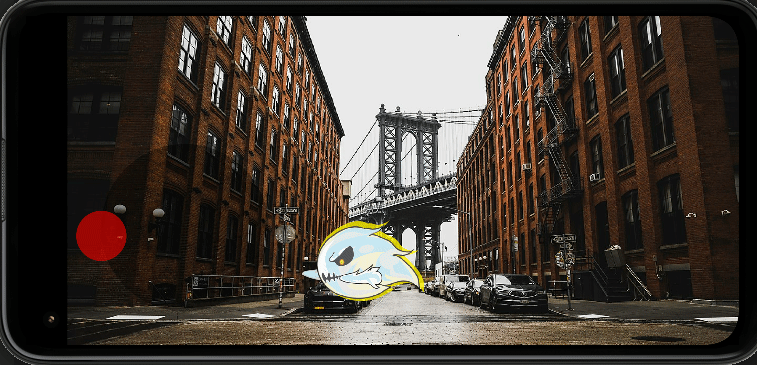

# Flame World Bounds Demo

kavdir_bounds_test

Question from Bugra Kavdir on the video
[8. Game World Bounds Detection with Flame and Flutter - Charlie](https://www.youtube.com/watch?v=kknJMhnKYNc&lc=UgwvbjDo8sN7gB5UXsF4AaABAg)

From the [Charlie - Flame 1.2.0 tutorial series](https://www.youtube.com/playlist?list=PLxvyAnoL-vu4H9YM8on7AKNRMOsTOdIle)

## Art Credits

* [ghost](https://opengameart.org/content/ghost-sprite)  by artist ChiliGames
* [manhattan](https://commons.wikimedia.org/wiki/File:Manhattan_through_Dumbo_(Unsplash).jpg) Wikimedia

## Environment
